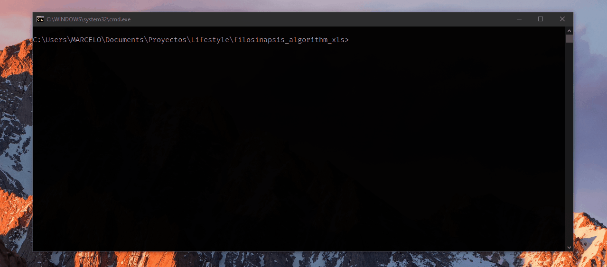

<h1 align="center">✍ AutoSinapsis 📓</h1>

Intelligent algorithm that converts document data to JSON-readable

<!-- Shields -->
<!--
  Languages, frameworks, design
  https://simpleicons.org/
-->

  <!-- Python -->
  
  <!-- JavaScript -->
  

## 📃 License
Distributed under the MIT License.
See [`LICENSE`](./LICENSE) for more information.
